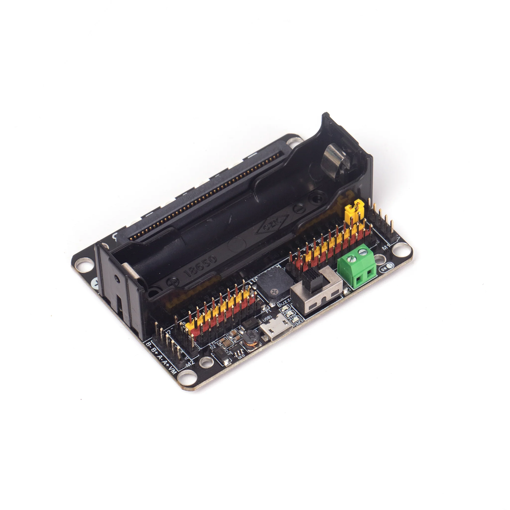
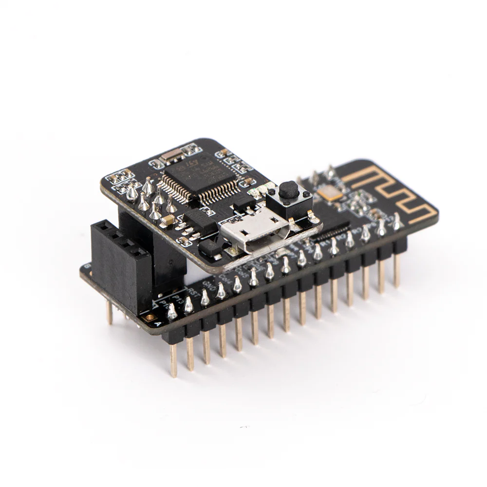

# Micro:bit Robot for MakeCode

This extension contains **blocks for most 2 wheeled robots available for the micro:bit**.
This library is compatible with micro:bit V1 and V2.


-   [DFRobot Maqueen](#dfrobot-maq)
-   [DFRobot Maqueen Plus](#dfrobot-maq-plus)
-   [Elecfreaks Cutebot](#cutebot)
-   [Elecfreaks Cutebot PRO](#cutebot-pro)
-   [InkSmith K8](#inksmith-k8)
-   [KeyStudio KS0426 Mini Smart Robot](#keystudio-mini)
-   [KittenBot MiniLFR](#kittenbot-mlfr)
-   [KittenBot Robotbit](#kittenbot-robotbit)
-   [KittenBot Nanobit](#kittenbot-nanobit)
-   [Yahboom Tiny:bit](#yahboom)

### Hardware requirements

The firmware is designed for popular rover robots found in the micro:bit ecosystem
(and more can be added):

-   2 motors that can be forward, backward, left, right turns. Precise detection of distance is **not** needed.
-   2 or more line sensors
-   a distance sensor, typically an ultrasonic sensor

The following features are found often but are optional:

-   RGB LEDs
-   Buzzer
-   Programmable LED strip

## Using this extension

-   Open https://makecode.microbit.org
-   Add this extension to your project by adding url `https://github.io/microsoft/microbit-robot`

## Blocks

-   Add the block to select the robot model you will be using. **This should be done before using any other blocks**.

```blocks
robot.elecfreaksCuteBot.start()
```

-   Use the blocks to control the robot.

```blocks
input.onButtonPressed(Button.A, () => {
    robot.motorRun(50, 50)
})
input.onButtonPressed(Button.B, () => {
    robot.motorStop()
})
```

## Usage with MicroCode

Download this firmware onto the micro:bit that stays on the robot. Then use MicroCode to send commands
to the robot.

-   [Documentation](https://microsoft.github.io/microcode/docs/robot)

## Supported targets

-   for PXT/microbit
-   for PXT/calliope

### DFRobot Maqueen V2+ {#dfrobot-maq}

{:class="photo"}

-   [Home](https://wiki.dfrobot.com/micro_Maqueen_for_micro_bit_SKU_ROB0148-EN)
-   [Download for micro:bit V1](https://microsoft.github.io/microbit-robot/assets/robot-dfrobot-maqueen-for-microbit-v1.hex)
-   [Download for micro:bit V2](https://microsoft.github.io/microbit-robot/assets/robot-dfrobot-maqueen-for-microbit-v2.hex)

### DFRobot Maqueen Plus V2 {#dfrobot-maq-plus}

{:class="photo"}

-   [Home](https://www.dfrobot.com/product-2026.html)
-   [Download for micro:bit V1](https://microsoft.github.io/microbit-robot/assets/robot-dfrobot-maqueen-plus-for-microbit-v1.hex)
-   [Download for micro:bit V2](https://microsoft.github.io/microbit-robot/assets/robot-dfrobot-maqueen-plus-for-microbit-v2.hex)

### Elecfreaks Cutebot {#cutebot}

{:class="photo"}

-   [Home](https://www.elecfreaks.com/micro-bit-smart-cutebot.html)
-   [Download for micro:bit V1](https://microsoft.github.io/microbit-robot/assets/robot-elecfreaks-cutebot-for-microbit-v1.hex)
-   [Download for micro:bit V2](https://microsoft.github.io/microbit-robot/assets/robot-elecfreaks-cutebot-for-microbit-v2.hex)

### Elecfreaks Cutebot PRO {#cutebot-pro}

{:class="photo"}

-   [Home](https://shop.elecfreaks.com/products/elecfreaks-smart-cutebot-pro-v2-programming-robot-car-for-micro-bit)
-   [Download for micro:bit V1](https://microsoft.github.io/microbit-robot/assets/robot-elecfreaks-cutebotpro-for-microbit-v1.hex)
-   [Download for micro:bit V2](https://microsoft.github.io/microbit-robot/assets/robot-elecfreaks-cutebotpro-for-microbit-v2.hex)

## InkSmith K8 {#inksmith-k8}

{:class="photo"}

-   [Home](https://www.inksmith.ca/products/k8-robotics-kit)
-   [Download for micro:bit V1](https://microsoft.github.io/microbit-robot/assets/robot-inksmith-k8-for-microbit-v1.hex)
-   [Download for micro:bit V2](https://microsoft.github.io/microbit-robot/assets/robot-inksmith-k8-for-microbit-v2.hex)

### KeyStudio KS0426 Mini Smart Robot {#keystudio-mini}

-   [Home](https://wiki.keyestudio.com/KS0426_Keyestudio_Micro%EF%BC%9Abit_Mini_Smart_Robot_Car_Kit_V2)
-   [Download for micro:bit V1](https://microsoft.github.io/microbit-robot/assets/robot-keystudio-minismartrobot-for-microbit-v1.hex)
-   [Download for micro:bit V2](https://microsoft.github.io/microbit-robot/assets/robot-keystudio-minismartrobot-for-microbit-v2.hex)

### KittenBot MiniLFR {#kittenbot-mlfr}

{:class="photo"}

-   [Home](https://www.kittenbot.cc/products/kittenbot-minilfr-programmable-robot-car-kit-for-microbit)
-   [Download for micro:bit V1](https://microsoft.github.io/microbit-robot/assets/robot-kittenbot-minilfr-for-microbit-v1.hex)
-   [Download for micro:bit V2](https://microsoft.github.io/microbit-robot/assets/robot-kittenbot-minilfr-for-microbit-v2.hex)

### KittenBot Robotbit {#kittenbot-robotbit}

{:class="photo"}

-   [Home](https://www.kittenbot.cc/products/robotbit-robotics-expansion-board-for-micro-bit)
-   [Download for micro:bit V1](https://microsoft.github.io/microbit-robot/assets/robot-kittenbot-robotbit-for-microbit-v1.hex)
-   [Download for micro:bit V2](https://microsoft.github.io/microbit-robot/assets/robot-kittenbot-robotbit-for-microbit-v2.hex)

### KittenBot Nanobit {#kittenbot-nanobit}

{:class="photo"}

-   [Home](https://www.kittenbot.cc/products/kittenbot-nanobit-with-kb-link-downloader-for-makecode-python-and-arduino-programming)
-   [Download for micro:bit V1](https://microsoft.github.io/microbit-robot/assets/robot-kittenbot-nanobit-for-microbit-v1.hex)
-   [Download for micro:bit V2](https://microsoft.github.io/microbit-robot/assets/robot-kittenbot-nanobit-for-microbit-v2.hex)

### Yahboom Tiny:bit {#yahboom}

{:class="photo"}

-   [Home](http://www.yahboom.net/study/Tiny:bit)
-   [Download for micro:bit V1](https://microsoft.github.io/microbit-robot/assets/robot-yahboom-tinybit-for-microbit-v1.hex)
-   [Download for micro:bit V2](https://microsoft.github.io/microbit-robot/assets/robot-yahboom-tinybit-for-microbit-v2.hex)

## License

MIT

## Contributing

This project welcomes contributions and suggestions. Most contributions require you to agree to a
Contributor License Agreement (CLA) declaring that you have the right to, and actually do, grant us
the rights to use your contribution. For details, visit https://cla.opensource.microsoft.com.

When you submit a pull request, a CLA bot will automatically determine whether you need to provide
a CLA and decorate the PR appropriately (e.g., status check, comment). Simply follow the instructions
provided by the bot. You will only need to do this once across all repos using our CLA.

This project has adopted the [Microsoft Open Source Code of Conduct](https://opensource.microsoft.com/codeofconduct/).
For more information see the [Code of Conduct FAQ](https://opensource.microsoft.com/codeofconduct/faq/) or
contact [opencode@microsoft.com](mailto:opencode@microsoft.com) with any additional questions or comments.

### How to prepare a pull request {#new-robot}

To add a new robot to the list, prepare a pull request in [microsoft/microbit-robot](https://github.com/microsoft/microbit-robot) with:

-   a new class extending `Robot` and configuring the hardware (see other robots)
-   a global field instance instantiating the robot (see other robots)
-   a URL in the jsdocs of the class pointing to the robot homepage
-   add `main{company}{productname}.ts` file that starts the robot
-   add `pxt-{company}{productname}.json` file that overrides the test files to load `main{company}{productname}.ts`
-   add call to `mkc pxt-{company}{productname}.json` in `.github/workflows/makecode.yml`
-   add image under `assets`

Make sure to test and tune the configuration options in the robot class for your particular
chassis/motor/line detectors. You may want to tweak some of the constants in the robot class to optimize the behavior of the robot.

## Trademarks

This project may contain trademarks or logos for projects, products, or services. Authorized use of Microsoft
trademarks or logos is subject to and must follow
[Microsoft's Trademark & Brand Guidelines](https://www.microsoft.com/en-us/legal/intellectualproperty/trademarks/usage/general).
Use of Microsoft trademarks or logos in modified versions of this project must not cause confusion or imply Microsoft sponsorship.
Any use of third-party trademarks or logos are subject to those third-party's policies.
